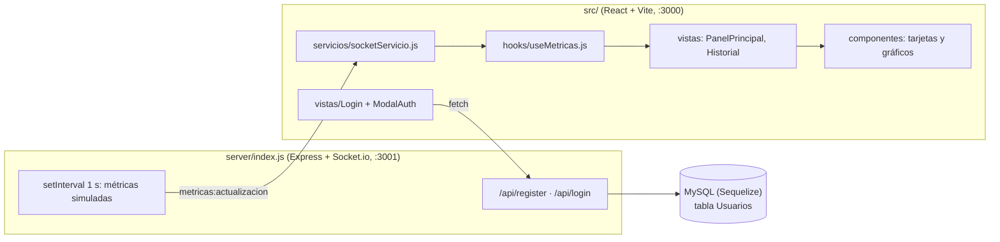

<div align="center">
  
  <h1>LiveMetrics</h1>
  <p><b>Dashboard React que muestra en vivo métricas de sistema (CPU, RAM, peticiones, usuarios, disco) recibidas por WebSocket.</b></p>
  
  
  
  
  
  
  <p>
    <a href="#-inicio-rápido">Inicio rápido</a> ·
    <a href="#-características">Características</a> ·
    <a href="#-arquitectura">Arquitectura</a> ·
    <a href="#-pruebas">Pruebas</a> ·
    <a href="#-lo-que-todavía-no-existe">Limitaciones</a>
  </p>
</div>

LiveMetrics es un **prototipo de dashboard**: un servidor Node emite cada segundo métricas **simuladas** (valores
aleatorios con fluctuación) por Socket.io y una interfaz React las dibuja en tarjetas y gráficos. **No** monitorea
ninguna máquina real. Incluye login/registro con MySQL y JWT.

> **Estado honesto:** en el commit actual `npm run build` y `vite` **fallan**: `PantallaCarga.jsx` e
> `IndicadorConexion.jsx` importan archivos `.css` que no existen en el repo. Por eso este README no incluye capturas.

## 🎬 Vista rápida

No se pudo capturar la interfaz (el front no compila, ver arriba). Flujo previsto por el código:

```text
/login ──(registro/login → POST /api/*, JWT en localStorage)──► /
   /                → 4 tarjetas + gráfico de líneas + anillo de disco + barras (datos por Socket.io)
   /historial       → tabla de las últimas 50 lecturas, filtro de alertas, descarga CSV
   /configuracion   → formulario de ajustes (simulado: solo muestra un alert)
```

## ✨ Características

| Característica | Detalle |
|---|---|
| Métricas en vivo | El servidor emite el evento `metricas:actualizacion` cada 1 s con cpu, memoria, peticiones, usuarios, disco y latencia de red (datos simulados, con picos aleatorios) |
| Panel principal | Tarjetas de CPU, RAM, Requests/s y Active Users; gráfico de líneas (Chart.js), anillo de disco y barras (D3) |
| Alertas | Toast de error si CPU > 85 % o memoria > 90 %, con enfriamiento de 5 s |
| Historial | Últimas 50 lecturas, filtro "solo alertas" (CPU o memoria ≥ 80 %) y exportación a CSV desde el navegador |
| Autenticación | `POST /api/register` y `POST /api/login` (bcrypt + JWT de 1 día) sobre MySQL con Sequelize |
| Tema | Modo claro/oscuro guardado en `localStorage` |
| Configuración | Pantalla de ajustes **simulada** (no persiste nada) |

## 🏗️ Arquitectura



## 🚀 Inicio rápido

| Requisito | Detalle |
|---|---|
| Node.js + npm | Sin versión declarada en `package.json` (Vite 6 pide Node 18+) |
| MySQL | Solo para login/registro (bases `livemetrics`, `livemetrics_test`, `livemetrics_prod` en `server/config/config.json`) |

```bash
git clone https://github.com/Luiss2080/LiveMetrics.git
cd LiveMetrics
npm ci
npm run server   # backend Socket.io en el puerto 3001
npm run dev      # frontend Vite en el puerto 3000
```

- `npm ci` funciona; `npm run server` arranca sin MySQL (Sequelize no consulta hasta el primer login).
- `npm run dev` levanta Vite pero **la pantalla muestra error de compilación** por los CSS faltantes.
- `scripts/.start.bat` (Windows) instala dependencias y lanza ambos procesos con `npx concurrently`.
- Las URLs `http://localhost:3001` están escritas a mano en `src/servicios/socketServicio.js` y `ModalAuth.jsx`.

<details>
<summary>Estructura de carpetas</summary>

```text
server/            # index.js (Express + Socket.io + auth), models/, migrations/, seeders/, config/
src/
  componentes/     # auth, dashboard, estado, graficos, layout
  configuracion/   # d3Config.js, graficosConfig.js
  contextos/       # TemaContext.jsx
  hooks/           # useMetricas.js, useConexion.js
  servicios/       # socketServicio.js
  utilidades/      # formateadores.js, generadores.js
  vistas/          # PanelPrincipal, Historial, Configuracion, Login
public/logo.jpg
```

`ESTRUCTURA.md` describe una organización anterior (carpetas `encabezado/`, `tarjetas/`, `variables.css`…) que ya no
coincide con el árbol real.

</details>

<details>
<summary>Base de datos</summary>

Hay una migración (`create-usuario`), un modelo `Usuario` (nombre, email, password) y un seeder que inserta un usuario
administrador de desarrollo. El repo no trae `.sequelizerc`, así que `sequelize-cli` no encuentra solo la carpeta
`server/` (no verificado el comando exacto para migrar).

</details>

## 🧪 Pruebas

`npm test` (`node --test`, carpeta `test/`) cubre el contrato de métricas entre servidor y cliente. No hay integración continua.

## 🔒 Seguridad

Implementado: contraseñas con bcrypt y respuesta genérica "Credenciales inválidas".
El secreto del JWT viene de `JWT_SECRET` (obligatorio, ≥32 caracteres, con `NODE_ENV=production`; en desarrollo, si falta,
se genera uno aleatorio por proceso) y CORS (API y Socket.io) solo admite los orígenes de `CORS_ORIGINS` (lista separada por
comas; por defecto `http://localhost:3000` y `http://127.0.0.1:3000`).
Las rutas del front validan el token contra `GET /api/sesion` antes de mostrarse (si es inválido se limpia `localStorage` y se
redirige a `/login`).
**Riesgos conocidos** (no apto para exponer a internet tal cual): el socket no exige autenticación; el usuario/clave de MySQL están en
`server/config/config.json`; el seeder crea una cuenta administradora conocida.

## 🚧 Lo que todavía no existe

- **No compila**: faltan `PantallaCarga.css` e `IndicadorConexion.css`.
- Métricas reales: todo es simulado; no hay conectores a servidores ni APIs.
- Configuración no guarda; el umbral de CPU de esa pantalla no afecta a las alertas (fijas en código).
- El historial vive solo en memoria del navegador (se pierde al recargar); no hay persistencia de métricas.
- Puertos y URLs fijos (3000/3001); sin variables de entorno para el front.
- Sin CI. La descripción del `package.json` lo llama "DataPulse".

## 📄 Licencia

MIT (ver `LICENSE`).

<div align="center"><sub>Hecho por Luiss2080 · LiveMetrics</sub></div>
