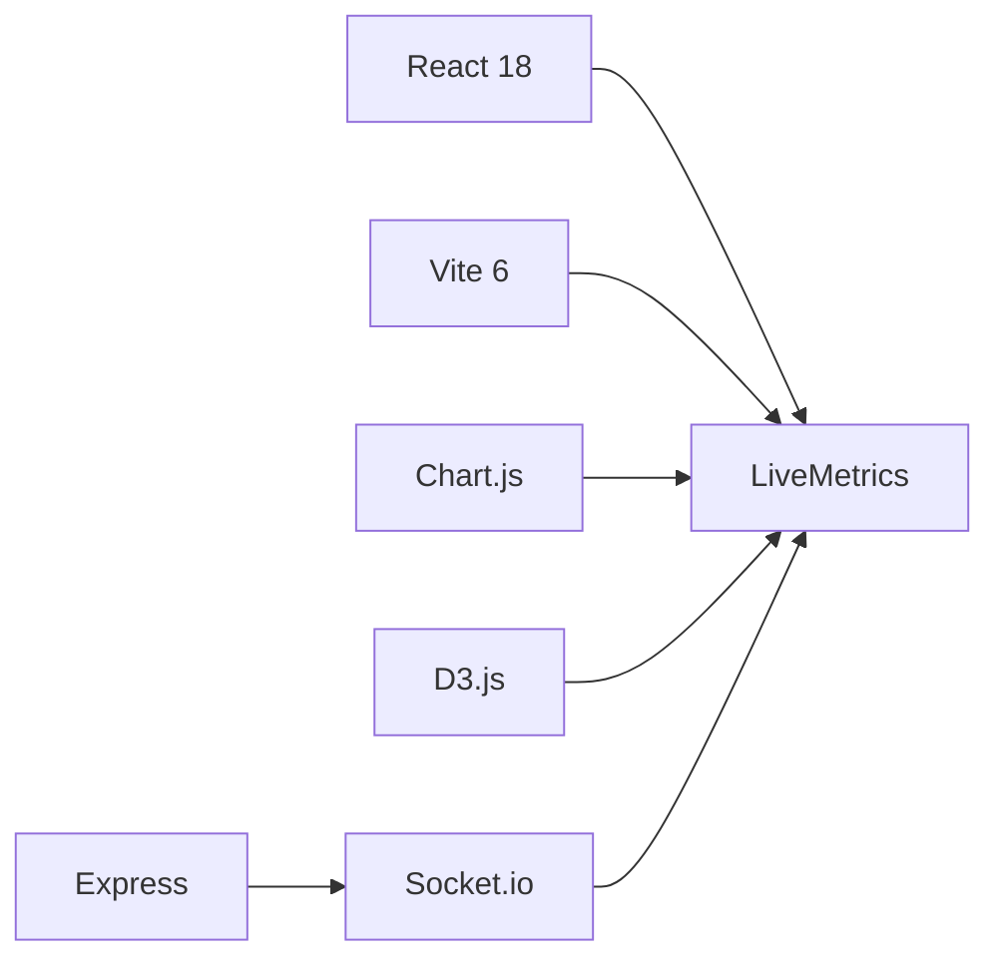

<div align="center">

# 📊 LiveMetrics

### *Visualización dinámica de métricas en tiempo real*

[](https://reactjs.org/)
[](https://d3js.org/)
[](https://www.chartjs.org/)
[](https://socket.io/)


</div>

---

## 🎯 ¿Qué es LiveMetrics?

**LiveMetrics** es un dashboard interactivo que visualiza métricas de sistemas en **tiempo real**. Diseñado para monitorear CPU, memoria, peticiones y usuarios activos con gráficos dinámicos y actualizaciones instantáneas vía WebSockets.

> 💡 **Ideal para:** Monitoreo de servidores, análisis de rendimiento, dashboards IoT, visualización de datos en tiempo real.

---

## ✨ Características Principales

<table>
<tr>
<td width="50%">

### 🎨 **Interfaz Moderna**
- Diseño glassmorphism
- Animaciones fluidas
- Tarjetas interactivas
- Responsive design

</td>
<td width="50%">

### ⚡ **Tiempo Real**
- Actualizaciones cada segundo
- Sin recargas de página
- WebSockets (Socket.io)
- Indicador de conexión

</td>
</tr>
<tr>
<td width="50%">

### 📈 **Visualizaciones**
- Gráficos de líneas (Chart.js)
- Gráficos de barras (D3.js)
- Tarjetas de métricas
- Alertas por color

</td>
<td width="50%">

### 🏗️ **Arquitectura Modular**
- 29 archivos organizados
- Componentes reutilizables
- Hooks personalizados
- Código mantenible

</td>
</tr>
</table>

---

## 🚀 Inicio Rápido

### 📋 Prerrequisitos

```bash
Node.js >= 16.x
npm >= 8.x
```

### ⚙️ Instalación

```bash
# Clonar el repositorio
git clone https://github.com/tu-usuario/livemetrics.git

# Navegar al directorio
cd livemetrics

# Instalar dependencias (ya instaladas en este proyecto)
npm install
```

### 🎬 Ejecución

<table>
<tr>
<td width="50%">

**1️⃣ Iniciar el servidor de datos**

```bash
npm run server
```
> 🟢 Servidor corriendo en `localhost:3001`

</td>
<td width="50%">

**2️⃣ Iniciar la aplicación**

```bash
npm run dev
```
> 🌐 App disponible en `localhost:3000`

</td>
</tr>
</table>

---

## 📸 Capturas de Pantalla

<div align="center">

| Dashboard Principal | Gráficos en Tiempo Real |
|:---:|:---:|
|  |  |

| Tarjetas de Métricas | Visualización D3.js |
|:---:|:---:|
|  |  |

</div>

---

## 🛠️ Stack Tecnológico



<div align="center">

| Frontend | Visualización | Backend | Build |
|:---:|:---:|:---:|:---:|
| React 18.3 | D3.js 7.9 | Express 4.18 | Vite 6.0 |
| React DOM | Chart.js 4.4 | Socket.io 4.7 | ESLint |

</div>

---

## 📦 Scripts Disponibles

| Comando | Descripción |
|---------|-------------|
| `npm run dev` | 🚀 Inicia el servidor de desarrollo (puerto 3000) |
| `npm run server` | 🔌 Inicia el servidor Socket.io (puerto 3001) |
| `npm run build` | 📦 Compila para producción |
| `npm run preview` | 👁️ Vista previa de la build |

---

## 📂 Estructura del Proyecto

```
LiveMetrics/
│
├── 📁 server/               # Backend Socket.io
│   └── index.js            # Servidor de métricas
│
├── 📁 src/
│   ├── 📁 componentes/     # Componentes UI (12 archivos)
│   │   ├── encabezado/     # Header
│   │   ├── estado/         # Indicadores
│   │   ├── graficos/       # Charts
│   │   ├── layout/         # Layout
│   │   └── tarjetas/       # Cards
│   │
│   ├── 📁 configuracion/   # Config (2 archivos)
│   ├── 📁 estilos/         # CSS (3 archivos)
│   ├── 📁 hooks/           # Custom hooks (2 archivos)
│   ├── 📁 servicios/       # Services (1 archivo)
│   ├── 📁 utilidades/      # Utils (2 archivos)
│   ├── 📁 vistas/          # Views (1 archivo)
│   │
│   ├── App.jsx             # Componente raíz
│   └── main.jsx            # Entry point
│
└── 📄 package.json         # Dependencias
```

> 📖 Ver [ESTRUCTURA.md](ESTRUCTURA.md) para más detalles

---

## 🎨 Métricas Monitoreadas

| Métrica | Descripción | Rango | Color |
|:---:|---|:---:|:---:|
| 💻 **CPU** | Uso del procesador | 0-100% | 🟢🟡🔴 |
| 🧠 **Memoria** | Uso de RAM | 0-100% | 🟢🟡🔴 |
| 📡 **Requests** | Peticiones por segundo | 0-1000 | 🟢 |
| 👥 **Usuarios** | Usuarios activos | 0-500 | 🟢 |

**Sistema de Alertas por Color:**
- 🟢 Verde: < 30% (Normal)
- 🟡 Amarillo: 30-70% (Advertencia)
- 🔴 Rojo: > 70% (Crítico)

---

## 🔮 Roadmap

- [ ] 🔐 Autenticación de usuarios
- [ ] 💾 Persistencia de datos (MongoDB/PostgreSQL)
- [ ] 📊 Más tipos de gráficos (pie, scatter, area)
- [ ] 🔔 Sistema de alertas/notificaciones
- [ ] 📱 Aplicación móvil (React Native)
- [ ] 🌙 Modo oscuro/claro
- [ ] 🎛️ Panel de configuración
- [ ] 📥 Exportar datos (CSV/JSON/PDF)
- [ ] 🔌 Conectores para APIs reales
- [ ] 📈 Análisis histórico con rangos de tiempo

---

## 🤝 Contribuir

¡Las contribuciones son bienvenidas! Por favor:

1. Fork el proyecto
2. Crea tu rama (`git checkout -b feature/AmazingFeature`)
3. Commit tus cambios (`git commit -m 'Add: Amazing Feature'`)
4. Push a la rama (`git push origin feature/AmazingFeature`)
5. Abre un Pull Request

---

## 📄 Licencia

Este proyecto está bajo la Licencia MIT. Ver `LICENSE` para más información.

---

## 💬 Contacto

**Desarrollador** - [@tu-usuario](https://github.com/tu-usuario)

**Link del Proyecto** - [https://github.com/tu-usuario/livemetrics](https://github.com/tu-usuario/livemetrics)

---

<div align="center">

### ⭐ Si te gusta este proyecto, ¡dale una estrella!

**Hecho con ❤️ usando React, D3.js, Chart.js y Socket.io**

[🐛 Reportar Bug](https://github.com/tu-usuario/livemetrics/issues) · [✨ Solicitar Feature](https://github.com/tu-usuario/livemetrics/issues) · [📖 Documentación](https://github.com/tu-usuario/livemetrics/wiki)

</div>
